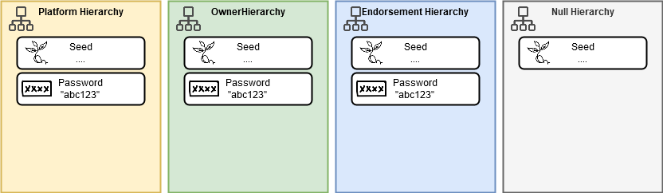
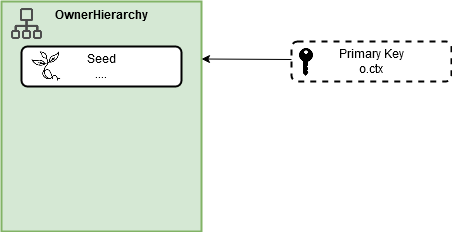
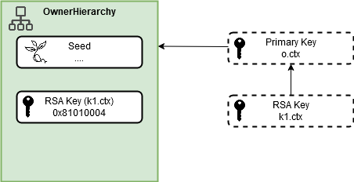
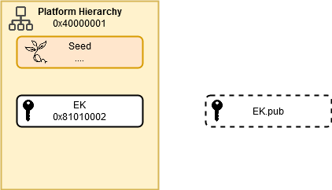
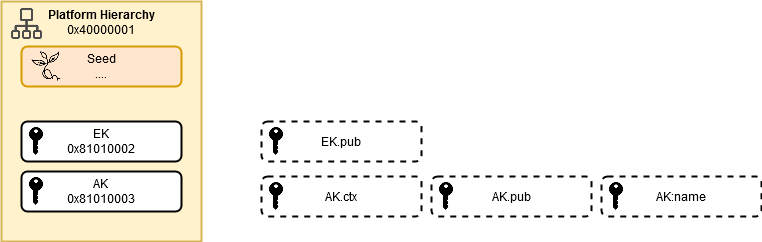

# Keys
- [Keys](#keys)
  - [Introduction](#introduction)
  - [Hierarchies and Use Cases](#hierarchies-and-use-cases)
  - [Creating A Hierarchy Primary Key](#creating-a-hierarchy-primary-key)
    - [Context Object](#context-object)
    - [Uniqueness of Primary Keys](#uniqueness-of-primary-keys)
  - [Creating Keys](#creating-keys)
    - [Persistence](#persistence)
    - [Reading the Public Part of a Key](#reading-the-public-part-of-a-key)
  - [Using Keys](#using-keys)
    - [Symmetric Encryption and Decryption](#symmetric-encryption-and-decryption)
    - [Asymmetric Encryption and Decryption](#asymmetric-encryption-and-decryption)
    - [Signing and Verification](#signing-and-verification)
  - [Loading External Keys](#loading-external-keys)
    - [Loading an external public key](#loading-an-external-public-key)
    - [Loading external public and private keys](#loading-external-public-and-private-keys)
    - [Encrypting and Decrypting with External Objects](#encrypting-and-decrypting-with-external-objects)
  - [Special Keys](#special-keys)
    - [Endorsement key](#endorsement-key)
    - [Attestation key](#attestation-key)

## Introduction
One of the major uses of the TPM is to generate, store and use encryption keys.
In this respect the TPM behaves like a minature HSM.
The TPM however is not designed as a crypto-accelerator and these operations are deliberately slow for security reasons.
The TPM is designed to hide the private part of keys in such a way it can not be retrieved from the TPM.

Note: in most of this section we use RSA public-private key pairs. Later on there are some examples using AES symmetric keys.

Note: we show the output from the commands which includes information about the keys, the public key etc. Your output will differ as each key generated is unique. Only if the same seed is used in the key derivation functions will you see the same key being generated. As we are using a simulator this can actually be forced to happen - in a production environment or on a real device, this should never happen.

## TPM Memory
TPMs have limited space for storing objects such as keys, session information etc. Different manufacturers provide different amounts of space and in some cases even behaviours when dealing with temporary objects. The IBM TPM Simulator used in the Dockerfiles has very limited storage and you'll find objects being left in the transient memory space.

If you receive out of memory errors from the simulator or any TPM then check if there are objects (typically keys) in the transient memory area; for example we can use `tpm2_getcap` to display this and in this example we have two objects in the transient area.

```bash
$tpm2_getcap handles-transient
0x80000000
0x80000001
```

To remove these objects use the command `tpm2_flushcontext -t` and check with `tpm2_getcap` again - if nothing is reported then all worked.

```bash
$tpm2_getcap handles-transient
0x80000000
0x80000001
$tpm2_flushcontext -t
$tpm2_getcap handles-transient
```

Later on you'll see the command `tpm2_evictcontrol` which gives finer grained control over this.

NOTE: normally temporary object are just temporary, but there are cases where and object is created here and is required by later operations in which case flushing the temporary area might have some other side-effects. This can be seen with certain credential and session auditing operations - these will be addressed later in this course and you don't have to worry about this for the time being.

## Hierarchies and Use Cases
The TPM has four hierarchies.

Three of the four hierarchies are used to provide the seeds and authorisation to create keys.

A key can be made persistent in three of the hierarchies. The null hierarchy is a temporary area only.

Hierarchies can be protected by passwords if set as described earlier.

Three of the hierarchies are meant for different use cases and may be locked during a provisioning process.

   * *Platform* is used for use cases relating to the overall system, eg: manufacturer or OEM supplied keys
   * *Endorsement* is used for use case relating to keys used for signing, identity, attestation etc
   * *Owner* is used for use cases relating to any other use case - this one would be typically unlocked for use by applications

The above are just guidelines - as far as the TPM is concerned, there are three hierarchies available for persistent storage and one for temporary.



## Creating A Hierarchy Primary Key
Each hierarchy has a seed from which a unique primary key for that hierarchy can be generated.
The primary key is the root key for all keys generated thereafter and effectively links those keys in a key hierarchy.

To create a primary key in the owner hierarchy:

   * `-C o` tells us to use the owner hierarchy
   * `-G rsa` tell us that we wish to generate an RSA key
   * `-g sha256` tell us that we wish to use the SHA256 hashing algorithm
   * `-c o.ctx` means to generate a TPM context object (called o.ctx)
   * `-a ` ... gives the attributes of the key - these will be explained later

```bash
$ tpm2_createprimary -C o -g sha256 -G rsa -c o.ctx
name-alg:
  value: sha256
  raw: 0xb
attributes:
  value: fixedtpm|fixedparent|sensitivedataorigin|userwithauth|restricted|decrypt
  raw: 0x30072
type:
  value: rsa
  raw: 0x1
exponent: 0x0
bits: 2048
scheme:
  value: null
  raw: 0x10
scheme-halg:
  value: (null)
  raw: 0x0
sym-alg:
  value: aes
  raw: 0x6
sym-mode:
  value: cfb
  raw: 0x43
sym-keybits: 128
rsa: daf0411d0000fb9a0cef9f24e512b2e8a6d4cbd288b8d39278853dd97b32c8d5247d757d7ced9148985c5ca0855038367f5fc91a15b168fdc3e7553d0ff59b851392b86c9667828576a3d3f0b1a9d5550df1251bee7969ca4c43403e024d97d1fd4fcdcfed9f8f5115e24450d24a5ea741e33594d99fda7fea3b2e799abb5131900fee62c8d6728da7e0aaa0351d5e9bcc59a5565d45fe6e942e7dfdd2ca22984bc0127a67a883ed58f7e872a96e148cf392f63ef1a36aeb54befa7918421eb0442a0ab86bd3d00d4b4e8a9145a8339ec138db0500b6f2260577e14fd2636fde4892c70b1a1d0bda44636eba9da7d8709c554a8c940473f3887287c257e91a01

```



And the context object:

```bash
$ ls -l o.ctx
-rw-rw-r--. 1 fedora fedora 2332 Apr  8 14:30 o.ctx
```

### Context Object
The context object is a blob containing the key itself, that can only be used by the TPM that generated it.
(NB: there is a way to make things portable, but later).

Because TPM has limited storage capabilities, the context object keeps the information that would normally reside in the TPM and be accessable via a handle on disk instead.
These are useful especially for primary keys, because storing these in a TPM would just take up space.
Primary keys are always regenerable.

### Uniqueness of Primary Keys
Each hierachy as mentioned as a seed and each time the primary key is generated it will be the same. We can easily demonstrate this. Let's generate two primary keys (using the ECC scheme):

```bash
tpm2_createprimary -C o -g sha256 -G ecc -c unique1.ctx
tpm2_createprimary -C o -g sha256 -G ecc -c unique2.ctx
```

The context object will differ at a binary level due to the internal naming of the keys.

However, if we examine two specific properties of the keys, the ECC x and y parameters using `tpm2_readpublic` we can see that they are the same.
The output here has been truncated to demonstrate this:

```bash
diff unique1.ctx unique2.ctx 
Binary files unique1.ctx and unique2.ctx differ

$ tpm2_readpublic -c unique1.ctx
x: 83b84da5b14f618a54f5e3e988d14c448e8d04a463d56a235bf0c4a0c99f5209
y: 2f8f5405f185d2077578f5861af011d0298a067471711ef24db4e7cf8ad5c382

$ tpm2_readpublic -c unique2.ctx
x: 83b84da5b14f618a54f5e3e988d14c448e8d04a463d56a235bf0c4a0c99f5209
y: 2f8f5405f185d2077578f5861af011d0298a067471711ef24db4e7cf8ad5c382
```

Note, it is possible to change the seeds of the platform and endorsement hierarchies using the commands `tpm2_changepps` and `tpm2_changeeps`. These commands are not in the version of the tools supplied by the tutorial and not all TPMs necessarily support changing of these seeds.

If the seed is changed the it will effectively sender the primary key for that hierarhcy and all keys under than hierarchy useless. You can figure out the potential for data loss yourselves.


## Creating Keys
Now that we have a primary key created, we can generate actual, usable keys.

First, we create a key.
If no details are specified, the tools will default to an RSA key using SHA256 hashing an a set of default attributes.

   * `-C o.otx`  - provides the parent object. In this case the context object of the primary key. We could specify a handle here.
   * `-u k1.pub` - the name of the file to which the public part of the key will be written
   * `-r k1.priv` - the name of the file to which the private part of the key will be written

```bash
$ tpm2_create -C o.ctx -u k1.pub -r k1.priv
name-alg:
  value: sha256
  raw: 0xb
attributes:
  value: fixedtpm|fixedparent|sensitivedataorigin|userwithauth|decrypt|sign
  raw: 0x60072
type:
  value: rsa
  raw: 0x1
exponent: 0x0
bits: 2048
scheme:
  value: null
  raw: 0x10
scheme-halg:
  value: (null)
  raw: 0x0
sym-alg:
  value: null
  raw: 0x10
sym-mode:
  value: (null)
  raw: 0x0
sym-keybits: 0
rsa: de474081ed402efd9b4f531e55272f88affea88b8885467f9bbe91efe4e09f39bde20f06c52f3bca86136d1dfd6a5e0034c26bac3e96ea13adaf1bdb3971b1364352d9f662c8577b756f48c7069a6306c9b6dd689a2c37873c224ef9b9326c8ee3bb8d495cdb16677702ea4523baab41c5eb055b6bf9c67b6811e49f21b59a6d68a459ea4e1232f784827584a3afb31098fc523ad50cb7ee3d948d6e91373855f15cc0c6f635f5bbb4d998e6d001a1de3a7db09aa00e99e117f3dfd30db77db83f3dc8823e86087dbf9d9329918e4da753ee494426342099f401f508c7c2098ed0d7d0cb599055aff97f5761665e5393e1a2bd1c0219c335e8ada258271d310f

```


Now that the key has been generated, we can list the files.

```bash
$ ls
k1.priv  k1.pub  o.ctx
```

Now, we must load the key into the TPM to be able to use it.
This process places the key into the transient part of the device.

```bash
$ tpm2_load -C o.ctx -u k1.pub -r k1.priv -c k1.ctx
name: 000b0fc7d55dacdf3cdd443a7724316b0bd0a90525f75aa8a809185c36584520630d
```

   * `-C o.otx` - the parent key
   * `-u k1.pub` - the name of the file holding the public key
   * `-r k1.priv` - the name of the file holding the private key
   * `-c k1.ctx` - the context object for this key

Once the key has been loaded, we can use it via its context object. 

### Persistence
If we wish to make the key persistent between restarts of the TPM, then we need to move the key from transient memory to persistent memory.

```bash
$ tpm2_evictcontrol -C o -c k1.ctx 0x81010004
persistent-handle: 0x81010004
action: persisted
``` 

We can use `tpm2_getcap` to show the persistent handles:

```bash
tpm2_getcap handles-persistent
- 0x81010004
```



If we try to place to object in the wrong hierarchy, we get an error:

```bash
$ tpm2_evictcontrol -C p -c k1.ctx 0x81010004
WARNING:esys:src/tss2-esys/api/Esys_EvictControl.c:326:Esys_EvictControl_Finish() Received TPM Error 
ERROR:esys:src/tss2-esys/api/Esys_EvictControl.c:114:Esys_EvictControl() Esys Finish ErrorCode (0x00000285) 
ERROR: Esys_EvictControl(0x285) - tpm:handle(2):hierarchy is not enabled or is not correct for the use
ERROR:esys:src/tss2-esys/esys_tr.c:357:Esys_TR_Close() Error: Esys handle does not exist (70018). 
ERROR: Esys_TR_Close(0x1) - tpm:error(1.2): unknown version 1.2 error code
ERROR: Unable to run tpm2_evictcontrol
```

To remove the key the process is such

```bash
$ tpm2_evictcontrol 0x81010004
$ tpm2_getcap handles-persistent
```

### Reading the Public Part of a Key
If we wish to examine a loaded object or a key persisted at some handle, we can output the details using `tpm2_readpublic`.

```bash
$ tpm2_readpublic -c  k1.ctx
name: 000b0fc7d55dacdf3cdd443a7724316b0bd0a90525f75aa8a809185c36584520630d
qualified name: 000b76956fbd30635aca249ddfc6949b80e8eace9d1f0e46c2b4cdbb2840e96f17c6
name-alg:
  value: sha256
  raw: 0xb
attributes:
  value: fixedtpm|fixedparent|sensitivedataorigin|userwithauth|decrypt|sign
  raw: 0x60072
type:
  value: rsa
  raw: 0x1
exponent: 0x0
bits: 2048
scheme:
  value: null
  raw: 0x10
scheme-halg:
  value: (null)
  raw: 0x0
sym-alg:
  value: null
  raw: 0x10
sym-mode:
  value: (null)
  raw: 0x0
sym-keybits: 0
rsa: ed357b6799949b22cacf76804017257a4649b8b8dcc209b9f41b4b630c7d98f1e909ed7d9dab897d031d344380f79eeec8acea027d3d8743b521483c3d0880b80a3c167a03358148c6d6017bb629fc2cb151662791717fe88bb35e1bd1f4e8b720326ec6d1ced62dba330b73b3dac04f44b62479f8aa6e2fdb01053b53b726ff051e91f09a1814bbfa1fbf3edd8cbde016d8c5727dd980723bdc6c9d806a1d89c17e928a980f8dccbf4c87a4ef590cd79819a5e6886644d1e9130d4bbb0b09631e3597edb4d670a9da66b9e06e0af5f7c2a891ab2fac44b578df0264a8a59aaf2a887b1c4dfb3274218577d9fe73b17db386cf25864a3e2868e97def64bd3019
```

The above is in the TSS format which isn't that useful.

We can output in PEM format - usable by other tools such as openssl - like so:

```bash
$ tpm2_readpublic -Q -c k1.ctx -f "pem" -o k1.pem
$ cat k1.pem
-----BEGIN PUBLIC KEY-----
MIIBIjANBgkqhkiG9w0BAQEFAAOCAQ8AMIIBCgKCAQEA7TV7Z5mUmyLKz3aAQBcl
ekZJuLjcwgm59BtLYwx9mPHpCe19nauJfQMdNEOA957uyKzqAn09h0O1IUg8PQiA
uAo8FnoDNYFIxtYBe7Yp/CyxUWYnkXF/6IuzXhvR9Oi3IDJuxtHO1i26Mwtzs9rA
T0S2JHn4qm4v2wEFO1O3Jv8FHpHwmhgUu/ofvz7djL3gFtjFcn3ZgHI73GydgGod
icF+koqYD43Mv0yHpO9ZDNeYGaXmiGZE0ekTDUu7CwljHjWX7bTWcKnaZrngbgr1
98KokasvrES1eN8CZKilmq8qiHscTfsydCGFd9n+c7F9s4bPJYZKPiho6X3vZL0w
GQIDAQAB
-----END PUBLIC KEY-----
``` 

   * `-f "pem"`  --- format of the output
   * `-o filename` --- file into which the output is stored
   * `-Q` --- QUIET! This supresses the output to the console, useful for commands that generate huge amounts of console based output

We can also output in the DER format.
This time the output is in binary, hence the use of `hexdump`:

```bash
$ tpm2_readpublic -Q -c k1.ctx -f "der" -o k1.der
$ cat k1.der | hexdump
0000000 8230 2201 0d30 0906 862a 8648 0df7 0101
0000010 0501 0300 0182 000f 8230 0a01 8202 0101
0000020 ed00 7b35 9967 9b94 ca22 76cf 4080 2517
0000030 467a b849 dcb8 09c2 f4b9 4b1b 0c63 987d
0000040 e9f1 ed09 9d7d 89ab 037d 341d 8043 9ef7
0000050 c8ee eaac 7d02 873d b543 4821 3d3c 8008
0000060 0ab8 163c 037a 8135 c648 01d6 b67b fc29
0000070 b12c 6651 9127 7f71 8be8 5eb3 d11b e8f4
0000080 20b7 6e32 d1c6 d6ce ba2d 0b33 b373 c0da
0000090 444f 24b6 f879 6eaa db2f 0501 533b 26b7
00000a0 05ff 911e 9af0 1418 fabb bf1f dd3e bd8c
00000b0 16e0 c5d8 7d72 80d9 3b72 6cdc 809d 1d6a
00000c0 c189 927e 988a 8d0f bfcc 874c efa4 0c59
00000d0 98d7 a519 88e6 4466 e9d1 0d13 bb4b 090b
00000e0 1e63 9735 b4ed 70d6 daa9 b966 6ee0 f50a
00000f0 c2f7 91a8 2fab 44ac 78b5 02df a864 9aa5
0000100 2aaf 7b88 4d1c 32fb 2174 7785 fed9 b173
0000110 b37d cf86 8625 3e4a 6828 7de9 64ef 30bd
0000120 0219 0103 0100                         
0000126
```

Finally, using `openssl`, we can examine the outputs from above, for example the PEM file:

```bash
$ openssl rsa -pubin -inform "pem" -text -in k1.pem
RSA Public-Key: (2048 bit)
Modulus:
    00:ed:35:7b:67:99:94:9b:22:ca:cf:76:80:40:17:
    25:7a:46:49:b8:b8:dc:c2:09:b9:f4:1b:4b:63:0c:
    7d:98:f1:e9:09:ed:7d:9d:ab:89:7d:03:1d:34:43:
    80:f7:9e:ee:c8:ac:ea:02:7d:3d:87:43:b5:21:48:
    3c:3d:08:80:b8:0a:3c:16:7a:03:35:81:48:c6:d6:
    01:7b:b6:29:fc:2c:b1:51:66:27:91:71:7f:e8:8b:
    b3:5e:1b:d1:f4:e8:b7:20:32:6e:c6:d1:ce:d6:2d:
    ba:33:0b:73:b3:da:c0:4f:44:b6:24:79:f8:aa:6e:
    2f:db:01:05:3b:53:b7:26:ff:05:1e:91:f0:9a:18:
    14:bb:fa:1f:bf:3e:dd:8c:bd:e0:16:d8:c5:72:7d:
    d9:80:72:3b:dc:6c:9d:80:6a:1d:89:c1:7e:92:8a:
    98:0f:8d:cc:bf:4c:87:a4:ef:59:0c:d7:98:19:a5:
    e6:88:66:44:d1:e9:13:0d:4b:bb:0b:09:63:1e:35:
    97:ed:b4:d6:70:a9:da:66:b9:e0:6e:0a:f5:f7:c2:
    a8:91:ab:2f:ac:44:b5:78:df:02:64:a8:a5:9a:af:
    2a:88:7b:1c:4d:fb:32:74:21:85:77:d9:fe:73:b1:
    7d:b3:86:cf:25:86:4a:3e:28:68:e9:7d:ef:64:bd:
    30:19
Exponent: 65537 (0x10001)
writing RSA key
-----BEGIN PUBLIC KEY-----
MIIBIjANBgkqhkiG9w0BAQEFAAOCAQ8AMIIBCgKCAQEA7TV7Z5mUmyLKz3aAQBcl
ekZJuLjcwgm59BtLYwx9mPHpCe19nauJfQMdNEOA957uyKzqAn09h0O1IUg8PQiA
uAo8FnoDNYFIxtYBe7Yp/CyxUWYnkXF/6IuzXhvR9Oi3IDJuxtHO1i26Mwtzs9rA
T0S2JHn4qm4v2wEFO1O3Jv8FHpHwmhgUu/ofvz7djL3gFtjFcn3ZgHI73GydgGod
icF+koqYD43Mv0yHpO9ZDNeYGaXmiGZE0ekTDUu7CwljHjWX7bTWcKnaZrngbgr1
98KokasvrES1eN8CZKilmq8qiHscTfsydCGFd9n+c7F9s4bPJYZKPiho6X3vZL0w
GQIDAQAB
-----END PUBLIC KEY-----
```

All of the above can be accomplised by referring to a handle in the TPM rather than a context object.

We reload the context object, read the public portion and write it out to a file, compare this file with the earlier output from the context object and then evict the object from the TPM.

```bash
$ tpm2_evictcontrol -C o -c k1.ctx 0x81010004
persistent-handle: 0x81010004
action: persisted
$ tpm2_readpublic -Q -c 0x81010004 -f "pem" -o k1handle.pem
$ cat k1handle.pem 
-----BEGIN PUBLIC KEY-----
MIIBIjANBgkqhkiG9w0BAQEFAAOCAQ8AMIIBCgKCAQEAxX5NWO4PGGa9jjAH/6oa
OM7DuNhQAoPMeX7WzLUlsv8Ck8/tO4TldrlWcgtDGREyCxl+6A735/P7Om6w5N90
9e3G+s5O8clQqC/j8HOGZ1qppS9FCMcXhO4WwIx/yWOAR1amyPCMbQCVZucZOp/n
B19I04rb1zMCxUqiALSyFLLiTbNlpe7VwbCswt/7TCnZ1HU3NfQnKqxxWzW06C60
ixl3bGlUB3QQJwkUgEyJZlCh6MDkTQqOiVaQs7OZvk7nP2+l3YZUCqjqLt6gSy2Q
i2BEzDY+qJPHGV7pXC1LuLgAwOIANSUeFBzXc0AacKuHEhRwuu6mCHbCVll5AC+C
lQIDAQAB
-----END PUBLIC KEY-----
$ diff k1handle.pem k1.pem
$ tpm2_evictcontrol -c 0x81010004
persistent-handle: 0x81010004
action: evicted
```

Note: Keep the file `o.ctx` around, we will use it in the next sections.

## Using Keys
In this section, we show the four basic operations related to keys.

   * Encryption
   * Decryption
   * Signing
   * Verification

First, we will create a primary key under the owner hierarchy and a new RSA key under that.
We will store both keys in the handles given in the example below.
After this exercise both keys can be removed.

We will use the `o.ctx` file that we created in the [Primary Key](#primary-key) section.
This context file contains the primary key we generated in the owner hierarchy.

The TPM 2.0 standard provides for at least three key families:

   * RSA
   * ECC
   * AES

We'll demonstrate both symmetric and assymmetric schemes below.
Their operations are similar but the commands used have different namings.

### Symmetric Encryption and Decryption
First, we create an AES key:

```bash
tpm2_create -C o.ctx -g sha256 -G aes -u mysymmetrickey.pub -r mysymmetrickey.priv
tpm2_load -C o.ctx -u mysymmetrickey.pub -r mysymmetrickey.priv -c mysymmetrickey.ctx
tpm2_evictcontrol -C o -c mysymmetrickey.ctx 0x81010020
```

Note: yes, it looks really odd that a symmetric key has a public and private part.
The actual symmetric key here is stored in the file `mysymmetrickey.priv`. 

When you generate a symmetric key you can optionally output the public object, but that is not a public object in the terms of public key crypto but instead a public object in TPM terms.
Meaning that this object (`mysymmetrickey.pub`) contains metadata about the AES key you created and the actual key is in `mysymmetrickey.priv` in this example.

Now, we have our key persisted in the handle `0x81010020`.

```bash
$ echo "My Password" > mysecret
$ tpm2_encryptdecrypt -c 0x81010020 -o mysecret.enc mysecret
WARN: Using a weak IV, try specifying an IV
$ cat mysecret.enc | hexdump
0000000 9736 1b07 0152 f14f ade4 5846          
000000c
```

The weak IV error relates to the initialisation vector used by the AES algorithm.
The tools are warning us that without an initialisation vector, the encryption is weak and prone to relatively easy attack.

Decryption is done similarly to encryption (except in reverse) using the `-d` option.

```bash
$ tpm2_encryptdecrypt -d -c 0x81010020 -o mysecret.dec mysecret.enc
WARN: Using a weak IV, try specifying an IV
```

We can also check that the encryption and decryption actually took place.

```bash
$ ls -l mysecret*
-rw-rw-r--. 1 fedora fedora 12 Apr 15 19:36 mysecret
-rw-rw-r--. 1 fedora fedora 12 Apr 15 19:42 mysecret.dec
-rw-rw-r--. 1 fedora fedora 12 Apr 15 19:36 mysecret.enc
$ diff mysecret mysecret.dec 
$ cmp mysecret mysecret.dec 
$ cat mysecret
My Password
$ cat mysecret.dec 
My Password
$ cat mysecret.enc | hexdump
0000000 8623 6c6c 17f3 8530 6868 1745          
000000c
```

### Asymmetric Encryption and Decryption
We can also use the TPM to do asymmetric encyption and decryption.
This uses specific commands for RSA encryption and decryption.

```bash
tpm2_create -C o.ctx -g sha256 -G rsa -u myasymmetrickey.pub -r myasymmetrickey.priv
tpm2_load -C o.ctx -u myasymmetrickey.pub -r myasymmetrickey.priv -c myasymmetrickey.ctx
tpm2_evictcontrol -C o -c myasymmetrickey.ctx 0x81010021
```

Now, we have our key persisted in the handle `0x81010021`.

As before, we will encrypt our secret password:

```bash
$ echo "My Password" > mysecret
$ tpm2_rsaencrypt -c 0x81010021 -o mysecret.enc2 mysecret
$ cat mysecret.enc2 | hexdump
0000000 1bc2 cf8f 43bf 695f d6d8 b97b 22d8 4fd0
0000010 649f 6b3b f7e9 1081 fba0 7d31 88c8 085d
0000020 2db8 faec b43a d7ec 1ea1 20a0 6f09 c0cc
0000030 f9a8 c47f f5c6 8360 7156 615e 0fc2 7721
0000040 7c50 ba4d 0712 6393 8e28 1204 c2b7 e377
0000050 d826 14b2 9260 9ba2 98b3 ddf8 6cdc 1aeb
0000060 bf93 1427 da85 24c2 4c07 e48e 1c7c 540f
0000070 df86 8b68 717a a4d7 a073 ea70 f160 c445
0000080 0c6c 43ca 8206 da4a 2048 af5f 93d1 3216
0000090 051b 9857 5034 dbfc 880a 5df2 e79f 6136
00000a0 10e7 08c7 32f2 aed3 b3cd a1da c7e2 3a67
00000b0 c3e2 f6c0 a639 9637 edc1 3806 9784 f308
00000c0 e939 fc6b a0f4 b184 ad81 af01 d7e7 e7cc
00000d0 0ed2 a4d0 342d af60 2a20 fab9 3633 689b
00000e0 8cd6 4821 308f 8505 4a4b 7423 5e35 18bc
00000f0 76c0 f3e8 a3db 468c 50b1 2008 274a 489c
0000100
```

RSA decryption has its own command:

```bash
$ tpm2_rsadecrypt -c 0x81010021 -o mysecret.dec2 mysecret.enc2
$ cat mysecret.dec2
My Password
```

Keep these keys in the TPM - don't evict them yet, we'll reuse them in the next section on signing

### Signing and Verification
We can cryptographically sign a message using the `tpm2_sign` command with the following options:

   * `-c` is the context object or handle of the signing key
   * `-g` is the hash algorithm used
   * `-o` is the output file into which the signature is written

Let's make our message a novel:

```bash 
$ echo "Once upon a time..." > myGreatNovel.txt
$ tpm2_sign -c 0x81010021 -g sha256 -o myGreatNovel.sig myGreatNovel.txt
$ cat myGreatNovel.sig | hexdump
0000000 1400 0b00 0001 5b59 2ee7 c816 891d 0897
0000010 9475 eb54 1dec f155 c2c0 f01d b6a5 0fd9
0000020 064a 8f00 5272 e1de 3cbf 9a6a 2367 5681
0000030 91d4 e68a d648 1e99 4513 aea8 79e7 07b4
0000040 a9f6 ba43 fe04 f181 b68a ae93 56bc d02b
0000050 0bf9 de77 1ca0 4019 328d 9bdb cdd0 5abd
0000060 3235 155d 3ca2 a8f2 fa90 12b0 101f 8577
0000070 0c2d 13a8 73c6 8cae 8437 7432 faf1 98df
0000080 8452 16e6 63b0 e9e3 0f05 c25b c202 ca8f
0000090 6b18 5c09 a504 799e d42d 506a 3c2d 9427
00000a0 474b 9f5e f2f2 8d3f cdb9 af9a 44a0 12ee
00000b0 cdba 81f1 75a3 ab13 8d78 dbc4 78ca 8614
00000c0 7ef1 4962 888c e15b f6aa 1b6f 8631 d4d9
00000d0 333b a90f efe1 236f 9d1d 54ac ebe4 8747
00000e0 6452 b7e4 7272 e4b9 f72e 9820 e3cb 2a86
00000f0 d0e6 0aec e9e6 d0e9 1325 8d63 543b c806
0000100 a0cb 7722 23ba                         
0000106
```

and to ensure that the novel has not been tampered with, we can verify it against the signature:

```bash
$ tpm2_verifysignature -c 0x81010021 -g sha256 -s myGreatNovel.sig -m myGreatNovel.txt
$ echo $?
0
```
   * `-c` is the context object or handle of the signing key
   * `-g` the hash algorithm to use
   * `-s` the signature file
   * `-m` the original file to check against

The `tpm2_verifysignature` command does not produce any output if successful.
It just returns code `0` back to the shell.

However, if the file has been tampered with:

```bash
$ echo "tampered" >> myGreatNovel.txt
$ tpm2_verifysignature -c 0x81010021 -g sha256 -s myGreatNovel.sig -m myGreatNovel.txt
WARNING:esys:src/tss2-esys/api/Esys_VerifySignature.c:302:Esys_VerifySignature_Finish() Received TPM Error 
ERROR:esys:src/tss2-esys/api/Esys_VerifySignature.c:103:Esys_VerifySignature() Esys Finish ErrorCode (0x000002db) 
ERROR: Esys_VerifySignature(0x2DB) - tpm:parameter(2):the signature is not valid
ERROR: Verify signature failed!
ERROR: Unable to run tpm2_verifysignature
$  echo $?
1
```

We get an error on `stderr` and the return code `1` back to the shell.
In fact, this how all the `tpm2_*` tools work, but as explained earlier in this tutorial we output everything.


## Loading External Keys
While the TPM can generate keys, it is often the case that keys will be generated externally.
The `tpm2_loadexternal` command functions similarly to the `tpm2_load` command introduced earlier.

### Loading an external public key
A typical scenario is one where you have been supplied a public key by someone.
The other party will have generated a public-private key pair using some mechanism, eg: a TPM or using `openssl`:

```bash
$ openssl genrsa -out private.pem 2048
Generating RSA private key, 2048 bit long modulus (2 primes)
...........................................+++++
....+++++
e is 65537 (0x010001)
$ openssl rsa -in private.pem -out public.pem -outform PEM -pubout
writing RSA key
$ ls private.pem public.pem 
private.pem  public.pem
$ ls -l private.pem public.pem 
-rw-------. 1 fedora fedora 1675 Apr 20 15:35 private.pem
-rw-rw-r--. 1 fedora fedora  451 Apr 20 15:35 public.pem
```

Whoever created the above might then send you their `public.pem` key, and you can load it into the TPM with the following command:

```bash
$ tpm2_loadexternal -C o -G rsa -u public.pem -c external1.ctx
name: 000b6475122adb0640594f51ebeba6de0580f061542fb53cb86d99e6fe70763fa76a
```

The context object is then used to access the key.

We can read the properties of this key as before:

```bash
$ tpm2_readpublic -c external1.ctx -f "pem" -o external1rp.pem
name: 000b6475122adb0640594f51ebeba6de0580f061542fb53cb86d99e6fe70763fa76a
qualified name: 000b6475122adb0640594f51ebeba6de0580f061542fb53cb86d99e6fe70763fa76a
name-alg:
  value: sha256
  raw: 0xb
attributes:
  value: userwithauth|decrypt|sign
  raw: 0x60040
type:
  value: rsa
  raw: 0x1
exponent: 0x10001
bits: 2048
scheme:
  value: null
  raw: 0x10
scheme-halg:
  value: (null)
  raw: 0x0
sym-alg:
  value: null
  raw: 0x10
sym-mode:
  value: (null)
  raw: 0x0
sym-keybits: 0
rsa: cab24fb663e504e3bcc5850017bec06e19d9059f540335c9c367f99990469092555c60030543bfb72ae5e02b043643eb95c9256821f1dce1056bfeaa396f0fb18011090703e38bb49fc2fde9c05b4efe77e16bc694497a313ab1680f23912321fbc75dbd57d368e73bdf73493f199199e3b7df4a81afae65b87d3a0ce448daadad8f39fb2d6524c76a2f46e90f2e49af7cb701a18a1f8d9c0519ead9be130ef6b22129b72bfa14648d875cea640cffbd1c7ef79b8f2fd2cc331617bd604c839eb4cc876ab01ba1d7747d4dcb427b5e36795f3fea882ede4447c80e8ee91e3103858d6bba86e2e18e3816c33f36833a452d14d19e22ae60bbe6e288bb05cf911b
```

And, if we compare what `openssl` generated against what we read from the TPM, it will not be a surprise that they are the same:

```bash
$ diff public.pem external1rp.pem
$ cat public.pem 
-----BEGIN PUBLIC KEY-----
MIIBIjANBgkqhkiG9w0BAQEFAAOCAQ8AMIIBCgKCAQEAyrJPtmPlBOO8xYUAF77A
bhnZBZ9UAzXJw2f5mZBGkJJVXGADBUO/tyrl4CsENkPrlcklaCHx3OEFa/6qOW8P
sYARCQcD44u0n8L96cBbTv534WvGlEl6MTqxaA8jkSMh+8ddvVfTaOc733NJPxmR
meO330qBr65luH06DORI2q2tjzn7LWUkx2ovRukPLkmvfLcBoYofjZwFGerZvhMO
9rIhKbcr+hRkjYdc6mQM/70cfvebjy/SzDMWF71gTIOetMyHarAbodd0fU3LQnte
NnlfP+qILt5ER8gOjukeMQOFjWu6huLhjjgWwz82gzpFLRTRniKuYLvm4oi7Bc+R
GwIDAQAB
-----END PUBLIC KEY-----
$ cat external1rp.pem 
-----BEGIN PUBLIC KEY-----
MIIBIjANBgkqhkiG9w0BAQEFAAOCAQ8AMIIBCgKCAQEAyrJPtmPlBOO8xYUAF77A
bhnZBZ9UAzXJw2f5mZBGkJJVXGADBUO/tyrl4CsENkPrlcklaCHx3OEFa/6qOW8P
sYARCQcD44u0n8L96cBbTv534WvGlEl6MTqxaA8jkSMh+8ddvVfTaOc733NJPxmR
meO330qBr65luH06DORI2q2tjzn7LWUkx2ovRukPLkmvfLcBoYofjZwFGerZvhMO
9rIhKbcr+hRkjYdc6mQM/70cfvebjy/SzDMWF71gTIOetMyHarAbodd0fU3LQnte
NnlfP+qILt5ER8gOjukeMQOFjWu6huLhjjgWwz82gzpFLRTRniKuYLvm4oi7Bc+R
GwIDAQAB
-----END PUBLIC KEY-----
```

External keys can not be made persistent so `tpm2_evictcontrol` will not work.

### Loading external public and private keys
The process for loading both the public and private keys is similar.
Using the keys we generated ealier, we can load the private key into the *null* hierarchy.
Attempting to load a key into the owner or platform hierarchies will result in a failure.

```bash
$ tpm2_loadexternal -C n -G rsa -r private.pem -c external2.ctx
name: 000b3acc07d18ee1d8d335959ff9f21f3281e82c879db0c3389efdc5789a385990b9
```

### Encrypting and Decrypting with External Objects
First, Alice creates a key pair called Alice. 

```bash
$ openssl genrsa -out aliceprivate.pem 2048
Generating RSA private key, 2048 bit long modulus (2 primes)
...........+++++
....................................+++++
e is 65537 (0x010001)
$ openssl rsa -in aliceprivate.pem -out alicepublic.pem -outform PEM -pubout
writing RSA key
```

Alice sends Bob her public key and he sends back a secret message, which is encrypted with Alice's public key.

```bash
$ echo "Secret message" > secretmessage.txt
$ openssl rsautl -encrypt -inkey alicepublic.pem -pubin -in secretmessage.txt -out secretmessage.enc
$ cat secretmessage.enc | hexdump
0000000 7933 31fc c2ba e703 4a51 7552 1750 1db7
0000010 35f7 092c 42be 7a3f f976 8e56 1f3a ef69
0000020 995e a6b1 0a0f 1cde 774b 7c57 9f4b 4cce
0000030 2692 94d3 fca8 c0bd c0a9 7baa 3678 9d7a
0000040 74bd e115 736d aa58 be70 54ac a39a ca24
0000050 d50a b6d1 0f88 4838 f2ab e130 1755 c84a
0000060 ebe8 adf9 e459 516b b113 96ed d815 bd38
0000070 849e f456 93f7 ec64 4eaa 8f37 f5dd b8cc
0000080 c856 00cf db98 361e 5405 82fb 7eaf 9e99
0000090 7346 e610 e913 8fb7 5490 0c4f 033b 5146
00000a0 b810 f92c 1537 0110 5773 2739 4266 50cc
00000b0 aaf0 ca8b c8a1 9da5 6da4 5f53 8d8f f5ca
00000c0 688c 49d1 4cb9 4e0d e1e6 e5dc d0c2 6e3a
00000d0 88ae a11f ef2b 33c3 1a4b 069b 34cb 8417
00000e0 23ce 3474 62e6 cd0e 0199 00b9 79e1 c514
00000f0 e3d9 d334 467d ea97 c3fb 826a 3beb 7b67
```

Alice has now received the secret message from Bob, that only she can decrypt by using the private part of her key pair.
So, she loads her private key into her TPM and uses it to decrypt the message from Bob.

```bash
$ tpm2_loadexternal -G rsa -C n -r aliceprivate.pem -c alice.ctx
name: 000bc6bce3a1ec9182e51e25dbb4a2e2af66ceb33806d32ffbb261a40851cf26c14d
$ tpm2_rsadecrypt -c alice.ctx -o secretmessage.dec secretmessage.enc
$ cat secretmessage.dec
Secret message
```

Alice is now happy.

A similar procedure can be done using Alice's private key and Bob decrypting it with Alice's public key.

Also, as an exercise, try doing this with AES symmetric keys (hint: use `tpm2_encryptdecrypt`).

## Special Keys
We can generate two public/private key pairs from the unique seed burned into each TPM chip that is manufactured: an Endorsement Key (EK) and an Attestation Key (AK).

The EK is a restricted key for encryption/decryption and the AK is a restricted key for signing.
*Restricted* means that these keys can only encrypt/decrypt/sign objects inside the TPM itself.
The private part of the keys can never be read off the TPM, we can only extract the public part.

While we refer to these keys as being special in some way, they are in fact the primary key for the endorsement hierarchy (EK) with a specific key generation template and a signing key derived from that (AK). The tpm2tools library provides convenience functions to generate these, hence their special nature.

NOTE: this section contains an error - the diagrams in the EK section should show the Endorsement Hierarhcy. Issue raised (Ian)

### Endorsement key
We can ask the TPM to generate the endorsement key with the following commnand:

```bash
$ tpm2_createek -c 0x81010002 -G rsa -u ek.pub
$ tpm2_getcap handles-persistent
- 0x81010002
- 0x81010020
- 0x81010021
```

This will use a key derivation function (KDF) to generate a keypair from the TPM seed.
The public part of this keypair will be written to the file `ek.pub` (in a TPM specific format) and it will store the key in persistent storage inside the TPM using handle `0x81010002`.
We can use this handle on other commands to instruct the TPM to use the EK for some operations (more on this later).
This allows us to use the EK in subsequent commands without having to generate it again each time.




We can read the public key from the handle using the following command:
```bash
$ tpm2_readpublic -c 0x81010002 -o ek.pem -f pem
name: 000b633b69cea48e41df39359bf8973058aab99d79d1e5ef966a505d4009b766e7e8
qualified name: 000ba671796c9b4f647e033db4ebdf182a91495cd8889e15e30203126424944c8e7b
name-alg:
  value: sha256
  raw: 0xb
attributes:
  value: fixedtpm|fixedparent|sensitivedataorigin|adminwithpolicy|restricted|decrypt
  raw: 0x300b2
type:
  value: rsa
  raw: 0x1
exponent: 0x0
bits: 2048
scheme:
  value: null
  raw: 0x10
scheme-halg:
  value: (null)
  raw: 0x0
sym-alg:
  value: aes
  raw: 0x6
sym-mode:
  value: cfb
  raw: 0x43
sym-keybits: 128
rsa: bfe4fbd70000b3cfbfa792cfa21dd2cdb944cef6322af5b1dceb61d6cd78c34e44f2494611779bc0f659df0a6d0769d6b627b9fbe52510ac77a7fc038395458dfe6c510bd50df1157083581c3c9af15547c80067f5894ebe586f0eac70f85b64bd9343050c63652ecfed7dbb6681fa38d7463ad3e8187c3156ccc18f3321b10fdd92b9d9cc1a8a68629ff837e296e92e66a78deeaaa3943a5fcc1b8dd6adc7927065109de0b7c55c866de4c1620d33cc2d803980e518a7e6fbd984fa2898f577033ccfc5a01612d29ecb44a08444f99ba0fc70fdc965e7544f32c0b7e9905000a59677ec66a3dd463341d102b94ae4ceb893104b06daf305315e32c7d77cb005
authorization policy: 837197674484b3f81a90cc8d46a5d724fd52d76e06520b64f2a1da1b331469aa
```

Optionally, this command can save the EK into a file in a different format, e.g. PEM.

```bash
$ cat ek.pem
-----BEGIN PUBLIC KEY-----
MIIBIjANBgkqhkiG9w0BAQEFAAOCAQ8AMIIBCgKCAQEAv+T71wAAs8+/p5LPoh3S
zblEzvYyKvWx3Oth1s14w05E8klGEXebwPZZ3wptB2nWtie5++UlEKx3p/wDg5VF
jf5sUQvVDfEVcINYHDya8VVHyABn9YlOvlhvDqxw+FtkvZNDBQxjZS7P7X27ZoH6
ONdGOtPoGHwxVszBjzMhsQ/dkrnZzBqKaGKf+DfilukuZqeN7qqjlDpfzBuN1q3H
knBlEJ3gt8Vchm3kwWINM8wtgDmA5Rin5vvZhPoomPV3AzzPxaAWEtKey0SghET5
m6D8cP3JZedUTzLAt+mQUACllnfsZqPdRjNB0QK5SuTOuJMQSwba8wUxXjLH13yw
BQIDAQAB
-----END PUBLIC KEY-----
```

### Attestation key
We can ask the TPM to generate the attestation key from the endorsement key and store it in a suitable handle in the TPM with the following commands:


* `-C` tells us where the EK is, it could be a handle or context object
* `-c` the output context object for the AK
* `-G` the encryption algorithm to use
* `-g` the hash algorithm
* `-s` the signing algorithm
* `-u` the public portion
* `-f` the output type for the public portion
* `-n` the name of the key (optional)


```bash
$ tpm2_createak -C 0x81010002 -c ak.ctx -G rsa -g sha256 -s rsassa -u ak.pub -f pem -n ak.name
loaded-key:
  name: 000b580a1671f0b85748a42bcdd216162bd82aee1bf331815e43bbbc582d5d872751
$ tpm2_evictcontrol -c ak.ctx 0x81010003
persistent-handle: 0x81010003
action: persisted
```




The `tpm2_evictcontrol' is similar to earlier examples.

This will use a KDF to create the attestation keypair.
This KDF uses the EK as an input as well, because the AK is in the same key hierarchy as the EK.
This command will also store the public part of the AK into `ak.pub` (in TPM specific format) and will make the AK persistent in handle `0x81010003` for later use.

One thing to take note is that the AK is used for signing only and not for encryption/decryption, hence the use of the `-s rsassa` parameter.

The AK's primary use is when signing quotes generated by the TPM.

Technically any key that is able to sign structures can be utilised as 'an attestation key', however deriving an attestation key explicitly from the EK provides us with certain certificate chain and identification properties which may (or are) useful during the attestation and quoting process.
